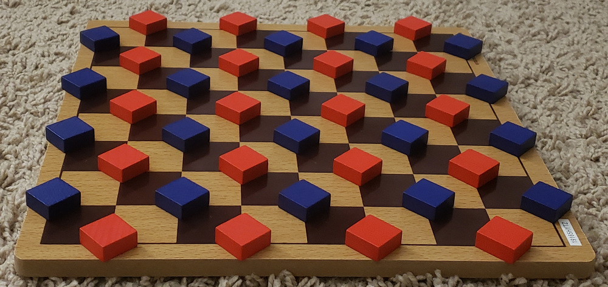

# Attach Your Units  
  
*Shuffle pieces around to form them into a big blob.*

## Winning
Join all your pieces into one unit, or trick your opponent into making it so you can't move.

## Units

A group of allied pieces orthogonally connected. (Like in Go)

## Moving

- The distance between two units is the shortest orthogonal path connecting them.
- When you move a unit you *must* reduce the distance to one of its closest neighbors.
    - If there is move that lets you do this, you win.
- Singleton units move one space orthogonally.
- Bigger units move like an amoeba. 
    - Take a piece from the unit and place it somewhere else adjacent to the unit
    - The unit can't be split in half after the move ( but can be split during the move).

---

[Full Rules and Strategy](https://mindsports.nl/index.php/arena/ayu)