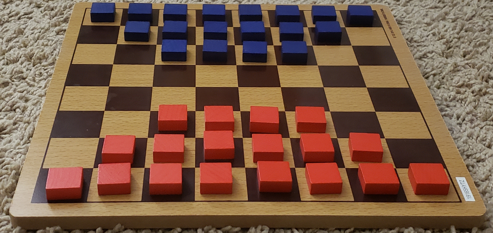

<!--author: Christian Freeling-->

<!--https://boardgamegeek.com/wiki/page/Checkers_Family#-->

  

## Generic Checkers Rules

These are the commonalities between Checkers variants.
Variants will have different setup, movement, etc.

Click to collapse. (You probably know this stuff already.)

### Winning

Capture all your opponent's pieces or make it so they otherwise cannot make a move.

### Movement and Capturing

- Players take turns moving pieces.
- Men move one space. <!--(Diagonally forwards in most variants.)-->
- Men capture by hopping over an adjacent enemy piece to the empty space on the other side.
- Kings move and capture in a similar manner.<!--, but have more options.-->
- In variants with **Flying Kings**, Kings can move and capture across longer distances.
    - A flying king can move in a straight line through as many empty spaces as he wants.
    - A flying king still captures by jumping over exactly one enemy piece in a straight line. But he doesn't have to start or end the jump adjacent to that target piece.

#### Mandatory Capturing

- Capturing is mandatory. If you can capture a piece, you can't choose to make a non-capturing move.
- Multiple captures can happen in a turn.
    - If the piece you just moved can capture again, it can and must do so as part of the same turn.
    - In most variant, the captured pieces are removed at the end of the turn. You can't capture the same piece twice, and dead pieces can thus sometimes 'block' additional captures.
    - In other variants, captured pieces are immediately removed. But pieces cannot immediate turn 180 for back-to-back captures.
- When multiple captures are available:
    - In some variants, you may freely choose which capture you want to do.
    - In other variants, You must choose a sequence which captures as many pieces as possible.

#### Promotion

- All pieces on the board start as Men.
- If a Man makes it to the back row, he is promoted to a King. 
    - In some variants, the Man is only promoted if he *ends the turn* in the back row.
    - In other variants, the Man can be promoted mid capture-sequence. He immediately becomes a King and can continue the capture sequence like one.

<!--
- If a Man ends his move on the back row, he is promoted to a King. 
- If a Man makes it to the back row in the middle of capture sequence, what happens?
    - In some variants, the Man immediately becomes a King and can continue the capture sequence.
    - In other variants, the Man is not promoted mid capture-sequence. He is only promoted if he ends his turn in the back row.
-->

## Rules for Dameo

Dameo is one of the most highly rated Checkers Variants on BGG.
In Dameo, pieces have diagonal movement, but orthogonal capture.
There is also a group movement rule to get the Men into action more quickly.

Game by Christian Freeling (2000).
[See here for full rules](https://boardgamegeek.com/thread/1747520/dameo-rule-set).
<!--
[See here for full rules](https://boardgamegeek.com/thread/1747520/dameo-rule-set) [and Strategy](https://mindsports.nl/images/stories/arena/damvar/Dameo.pdf) -->

### Setup

Setup your pieces by placing them in a trapezoid on the first three rows of the board.

<pre style="line-height:1.3; text-align: center;">
🔵🔵🔵🔵🔵🔵🔵🔵
⬜🔵🔵🔵🔵🔵🔵⬜
⬜⬜🔵🔵🔵🔵⬜⬜
⬜⬜⬜⬜⬜⬜⬜⬜
⬜⬜⬜⬜⬜⬜⬜⬜
⬜⬜🔴🔴🔴🔴⬜⬜
⬜🔴🔴🔴🔴🔴🔴⬜
🔴🔴🔴🔴🔴🔴🔴🔴
</pre>

<!--
⬜🟨⬜🟨⬜🟨⬜🟨
🟨⬜🟨⬜🟨⬜🟨⬜
⬜🟨⬜🟨⬜🟨⬜🟨
🟨⬜🟨⬜🟨⬜🟨⬜
⬜🟨⬜🟨⬜🟨⬜🟨
🟨⬜🟨⬜🟨⬜🟨⬜
⬜🟨⬜🟨⬜🟨⬜🟨
🟨⬜🟨⬜🟨⬜🟨⬜
⚫🔴⚪
⬛ 🔵🟡🟫
⬜⬜⬜⬜⬜⬜⬜⬜
⬜⬜⬜⬜⬜⬜⬜⬜
⬜⬜⬜⬜⬜⬜⬜⬜
⬜⬜⬜⬜⬜⬜⬜⬜
⬜⬜⬜⬜⬜⬜⬜⬜
⬜⬜⬜⬜⬜⬜⬜⬜
⬜⬜⬜⬜⬜⬜⬜⬜
⬜⬜⬜⬜⬜⬜⬜⬜
⬜🟫⬜🟫⬜🟫⬜🟫
🟫⬜🟫⬜🟫⬜🟫⬜
⬜🟫⬜🟫⬜🟫⬜🟫
🟫⬜🟫⬜🟫⬜🟫⬜
⬜🟫⬜🟫⬜🟫⬜🟫
🟫⬜🟫⬜🟫⬜🟫⬜
⬜🟫⬜🟫⬜🟫⬜🟫
🟫⬜🟫⬜🟫⬜🟫⬜
-->

### Moving

- Men can move **forward** or **diagonally forward**: ↖⬆↗
    - one space by himself
    - by jumping over a straight unbroken line of allied men (equivalently, move the entire line of men)
- Kings are **Flying** and move in **all eight directions**: ←↑→↓↖↗↙↘
- If a Man ends his move on the back row, he is promoted to a King. 

### Capturing

- Men capture **orthogonally** ←↑→↓
- Kings are **Flying** and capture **orthogonally**: ←↑→↓
- You have to **capture as many as possible**.

## Rules for King's Court

Game by Christopher Wroth (1986).
<!--
[See here for full rules](https://boardgamegeek.com/thread/1747520/dameo-rule-set) [and Strategy](https://mindsports.nl/images/stories/arena/damvar/Dameo.pdf) -->

Setup your pieces intermingled around all four edges of the board.

<pre style="line-height:1.3; text-align: center;">
🔴🔵🔴🔵🔴🔵🔴🔵
🔵🔴🔵🔴🔵🔴🔵🔴
🔴🔵⬜⬜⬜⬜🔴🔵
🔵🔴⬜⬜⬜⬜🔵🔴
🔴🔵⬜⬜⬜⬜🔴🔵
🔵🔴⬜⬜⬜⬜🔵🔴
🔴🔵🔴🔵🔴🔵🔴🔵
🔵🔴🔵🔴🔵🔴🔵🔴
</pre>

- Men move one space **orthogonally**: ←↑→↓
- Men capture **orthogonally** ←↑→↓
- Capturing is optional.
- You may also jump over your own pieces. This doesn't remove them from the board.
- Pieces are never promoted.
- In the first two turns, no jumping is permitted. Each player enters the central 4x4 "court".
- After the first two turns, you immediately lose if you don't have any pieces in the court.

## Regional Checkers Variants

### English Checkers

<pre style="line-height:1.3; text-align: center;">
⬜🔵⬜🔵⬜🔵⬜🔵
🔵⬜🔵⬜🔵⬜🔵⬜
⬜🔵⬜🔵⬜🔵⬜🔵
⬜⬜⬜⬜⬜⬜⬜⬜
⬜⬜⬜⬜⬜⬜⬜⬜
🔴⬜🔴⬜🔴⬜🔴⬜
⬜🔴⬜🔴⬜🔴⬜🔴
🔴⬜🔴⬜🔴⬜🔴⬜
</pre>

Moving:

- Men move one space **diagonally forward**: ↖↗ 
- Kings move one space **diagonally**: ↖↗↙↘
- If a Man ends his move on the back row, he is promoted to a King. 

Capturing:

- Men and Kings capture by hopping over an enemy in the same directions they can move.
- If there are multiple captures available, **you may choose** which to do.

### International Checkers

Board Setup:
Similar to English Checkers but on a 10x10 board.

<pre style="line-height:1.3; text-align: center;">
⬜🔵⬜🔵⬜🔵⬜🔵⬜🔵
🔵⬜🔵⬜🔵⬜🔵⬜🔵⬜
⬜🔵⬜🔵⬜🔵⬜🔵⬜🔵
🔵⬜🔵⬜🔵⬜🔵⬜🔵⬜
⬜⬜⬜⬜⬜⬜⬜⬜⬜⬜
⬜⬜⬜⬜⬜⬜⬜⬜⬜⬜
⬜🔴⬜🔴⬜🔴⬜🔴⬜🔴
🔴⬜🔴⬜🔴⬜🔴⬜🔴⬜
⬜🔴⬜🔴⬜🔴⬜🔴⬜🔴
🔴⬜🔴⬜🔴⬜🔴⬜🔴⬜
</pre>

Moving:

- Men move one space **diagonally forward**: ↖↗ 
- Kings are **Flying** and move **diagonally**: ↖↗↙↘
- If a Man ends his move on the back row, he is promoted to a King. 

Capturing:

- Men capture **diagonally**: ↖↗↙↘
- Kings are **Flying** and capture **diagonally**: ↖↗↙↘ 
- You have to **capture as many as possible**.

### Russian Checkers / Shashki

Board Setup:
Same as English Checkers.

<pre style="line-height:1.3; text-align: center;">
⬜🔵⬜🔵⬜🔵⬜🔵
🔵⬜🔵⬜🔵⬜🔵⬜
⬜🔵⬜🔵⬜🔵⬜🔵
⬜⬜⬜⬜⬜⬜⬜⬜
⬜⬜⬜⬜⬜⬜⬜⬜
🔴⬜🔴⬜🔴⬜🔴⬜
⬜🔴⬜🔴⬜🔴⬜🔴
🔴⬜🔴⬜🔴⬜🔴⬜
</pre>

Moving:

- Men move one space **diagonally forward**: ↖↗ 
- Kings are **Flying** and move **diagonally**: ↖↗↙↘

Capturing:

- Men capture **diagonally**: ↖↗↙↘
- Kings are **Flying** and capture **diagonally**: ↖↗↙↘
- If there are multiple captures available, **you may choose** which to do.
- A Man can be promoted mid-capture-sequence.

<!--- A Man is promoted to King if he reaches the back row,  mid-capture-sequence.-->

### Turkish Checkers / Dama

<pre style="line-height:1.3; text-align: center;">
⬜⬜⬜⬜⬜⬜⬜⬜
🔵🔵🔵🔵🔵🔵🔵🔵
🔵🔵🔵🔵🔵🔵🔵🔵
⬜⬜⬜⬜⬜⬜⬜⬜
⬜⬜⬜⬜⬜⬜⬜⬜
🔴🔴🔴🔴🔴🔴🔴🔴
🔴🔴🔴🔴🔴🔴🔴🔴
⬜⬜⬜⬜⬜⬜⬜⬜
</pre>

Moving:

- Men move one space **forward** or **sideways**: ←↑→ 
- Kings are **Flying** and move **orthogonally**: ←↑→↓
- If a Man ends his move on the back row, he is promoted to a King. 

Capturing:

- Men capture one space **forward** or **sideways**: ←↑→ 
- Kings are **Flying** and capture **orthogonally**: ←↑→↓
- You have to **capture as many as possible**.
- Pieces are *immediately* removed from the board when captured.

<!--- A Man is promoted to King if he reaches the back row,  mid-capture-sequence.-->

### Armenian Checkers / Tama

Board Setup:
Same as Turkish Checkers

<pre style="line-height:1.3; text-align: center;">
⬜⬜⬜⬜⬜⬜⬜⬜
🔵🔵🔵🔵🔵🔵🔵🔵
🔵🔵🔵🔵🔵🔵🔵🔵
⬜⬜⬜⬜⬜⬜⬜⬜
⬜⬜⬜⬜⬜⬜⬜⬜
🔴🔴🔴🔴🔴🔴🔴🔴
🔴🔴🔴🔴🔴🔴🔴🔴
⬜⬜⬜⬜⬜⬜⬜⬜
</pre>

Moving:

- Men move one space **forward, diagonally forward,** or **sideways**: ↖←↑→↗ 
- Kings are **Flying** and move in **all eight directions**: ←↑→↓↖↗↙↘
- If a Man ends his move on the back row, he is promoted to a King. 

Capturing:

- Men capture one space **forward** or **sideways**: ←↑→ 
- Kings are **Flying** and capture **orthogonally**: ←↑→↓
- You have to **capture as many as possible**.
- Pieces are *immediately* removed from the board when captured.

<!--- A Man is promoted to King if he reaches the back row,  mid-capture-sequence.-->

## Summary of Variants

<!--🇺🇸 🇬🇧 🇪🇸 🇲🇽 🇵🇹 🇧🇷 🇫🇷 🇩🇪 🇯🇵 🇨🇳 🇰🇷 🇮🇳-->

|       | Man Move | Man Capture |   King Move  | King Capture | Flying King? | Mid-Capture Promotion? | Majority Capture? | Immediate Removal? | Num. Pieces Per Player | Board Size |
|-------|:--------:|:-----------:|:------------:|:------------:|:------------:|:-------------------------:|:--------------------:|:---------------------:|:----------------------:|:----------:|
| 🇺🇸    |    ↖↗    |      ↖↗     |     ↖↗↙↘     |     ↖↗↙↘     |              |                           |                      |                       |           12           |     8x8    |
| 🗺️     |    ↖↗    |     ↖↗↙↘    |     ↖↗↙↘     |     ↖↗↙↘     |       ✅      |                           |           ✅          |                       |           20           |    10x10   |
| 🇷🇺    |    ↖↗    |     ↖↗↙↘    |     ↖↗↙↘     |     ↖↗↙↘     |       ✅      |             ✅             |                      |                       |           12           |     8x8    |
| Dameo |    ↖↑↗   |     ←↑→↓    | ←↑→↓ ↖↗↙↘ |     ←↑→↓     |       ✅      |                           |           ✅          |                       |           18           |     8x8    |
| 🇹🇷    |    ←↑→   |     ←↑→     |     ←↑→↓     |     ←↑→↓     |       ✅      |                           |           ✅          |           ✅           |           16           |     8x8    |
| 🇦🇲    |   ↖←↑→↗  |     ←↑→     | ←↑→↓ ↖↗↙↘ |     ←↑→↓     |       ✅      |                           |           ✅          |           ✅           |           16           |     8x8    |

<!--
row for phalanx rule?
|  |  |  |  |  |
←↑→↓
←↑→↓↖↗↙↘
←↖↑↗→↘↓↙
-->

<!--
https://www.iggamecenter.com/en/rules/bashni
Bashni - stacking mechanic I don't quite understand.
Emergo is similar https://www.iggamecenter.com/en/rules/emergo

Comments on Russian Checkers
Not my favourite version of checkers but a VAST improvement over English Draughts/American Checkers or International Checkers both of which are in my opinion horrendously boring games. The best checkers variants I have, so far, encountered are Turkish Checkers, Frisian Checkers, Bashni and the modern Dameo. Russian Checkers is nowhere near the standard of these other games but it sort of feels like the rule set that English Draughts/American Checkers or International Checkers should have had to make them into games you'd actually bother to play at all.
Only differences to Brazilian checkers is that in a capturing sequence, men promote to Kings(Queens) and continue capturing; and that there is NO requirement to select the sequence with the maximum number of captures.

https://www.iggamecenter.com/en/rules/halma
Halma is a bit different. The goal is to move your pieces to the opposite corner.
That's basically chinese checkers rules.
Oh. Huh. 
https://boardgamegeek.com/boardgame/2386/chinese-checkers
Chinese Checkers is actually called Stern-Halma.

Other breakthrough games include breakthrough?
https://www.iggamecenter.com/en/rules/breakthrough

https://www.iggamecenter.com/en/rules/harzdame
Harzdame is standard checkers turned 45degrees

-->