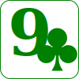
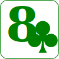
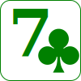
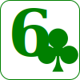
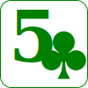

# Poker Hand Rankings

<table style="">
    <tr><td>5 of a Kind</td><td>
        
        
        
        
        </td></tr>
    <tr><td>Straight Flush</td><td>
        
        
        
        
        </td></tr>
    <tr><td>4 of a Kind</td><td>
        
        
        
        
        </td></tr>
    <tr><td>Full House</td><td>
        
        
        
        
        </td></tr>
    <tr><td>Flush</td><td>
        
        
        
        
        </td></tr>
    <tr><td>Straight</td><td>
        
        
        
        
        </td></tr>
    <tr><td>3 of a Kind</td><td>
        
        
        
        
        </td></tr>
    <tr><td>Two Pair</td><td>
        
        
        
        
        </td></tr>
    <tr><td>One Pair</td><td>
        
        
        
        
        </td></tr>
</table>

## Other Notes on Rankings

Individual Cards are ranked AKQJT98765432A, highest-to-lowest.

Ace can be high or low, but not both. So you can have a run of A2345 or TJQKA, but not QKA23.

To break ties between hands:

- Look at the ranks of the cards that count towards the hand.
- Look at the rank of other cards in the hole.
- Compare the suits.

When comparing two exactly identical hands, <b>♠</b> is ranked highest, followed by  <b>♥</b>,  <b>♦</b> , and then  <b>♣</b>. Reverse of alphabetical order: SHDC.

With two exactly identical hands, the winner is .

