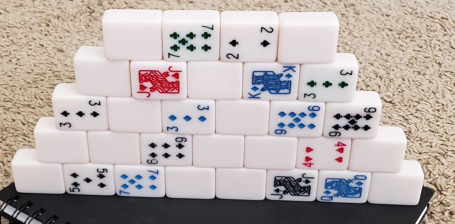

# Pyramid Poker

*Build and then tear down a pyramid to form three poker hands.*

This game requires "cards" which can stand on their sides.
Like mahjong style tiles.

1. Deal each player 15 cards face down
2. Players take turns putting cards onto a pyramid
    - Place the card so you can see its face but your opponent cannot
3. Next, players take turns removing cards from the pyramid.
   - When you take a card, place it in one of three face-up "hands" in front of you: left, center, or right. 
   - At the end of the game, each player will have three complete hands of five tiles each.
   - You can't change which hand it's in after you place it.
4. After all cards are taken, compare each pair of hands. Winner is whoever wins 2 out of 3 of these matchups.

---

2 players.
Adapted from the original game by Aaron Weissblum and Norman Woods
